## Índice

1. [Introducción](#Introducción)
2. [Obtención de los Datos](#Obtención_De_Los_Datos)
3. [Conjuntos de Datos](#Conjuntos_De_Datos)
4. [Dataset Estaciones de Servicio](#Dataset_Estaciones_De_Servicio)
5. [Dataset Precio Combustible Mensual](#Dataset_Precio_Combustible_Mensual)
6. [Pruebas de Ejecución](#Pruebas_De_Ejecución)
7. [Gráficas Histórico de precios](#Graficas)

# Introducción 

El objetivo del repositorio consiste en disponer de una forma abierta y fácilmente accesible el histórico de los precios de los combustibles en las distintas estaciones de servicio de España. Esto se debe a que la fuente oficial de la que se ha extraído esta información ([Datos Abiertos del Gobierno de España](https://datos.gob.es/es/catalogo/e05068001-precio-de-carburantes-en-las-gasolineras-espanolas)) proporciona estos datos de forma diaria, pero el acceso al histórico de precios es más tedioso y es necesario establecer un gran número de filtros para obtener esta información. Debido a ello, esta propuesta busca proporcionar un conjunto de datos en el que se muestren los precios diarios de los combustibles en todas las estaciones de servicio españolas de una forma más rápida y eficiente.

# Obtención de los datos 

La obtención de los datos se realiza de forma automática a partir del un servicio REST oficial de [Datos Abiertos del Gobierno de España](https://datos.gob.es/es/catalogo/e05068001-precio-de-carburantes-en-las-gasolineras-espanolas) (Ver Figura 1 y 2). Todos los días se ejecuta el script *obtenerPrecioCombustible.py* el cuál procesa la información de los precios, elimina las columnas innecesarias y le añade la fecha del día actual para así poder filtrar por ella posteriormente.

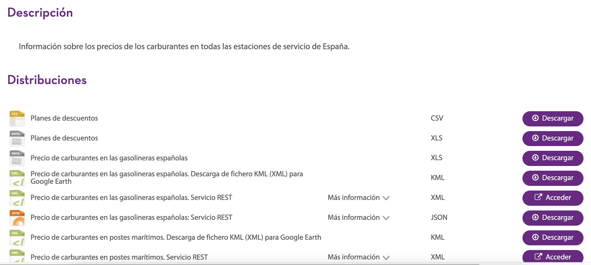
**Figura 1: Página oficial de los Datos Abiertos del Gobierno de España.**

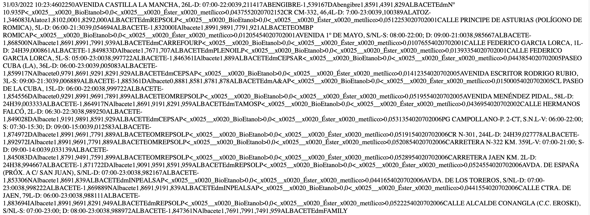
**Figura 2: Datos en crudo de las Estaciones de Servicio y los precios del combustible.**

El motivo de eliminar columnas se debe a que cada uno de los registros que devuelve la respuesta cuenta con toda la información de la estación de servicio: precios del combustible, datos postales, coordenadas, marca, etc. Dado que esta información no varía, se ha extraído a un fichero fijo aparte *EESSS.csv*. De esta forma se dispone de un fichero estático con los datos concretos de las estaciones de servicio (Ver Figura 3), y un fichero dinámico que se va actualizando con los datos de la fecha de consulta, el identificador de la estación de servicio, y los precios del combustible en dicha estación (Ver Figura 4). Gracias a esto se consigue reducir el tamaño de los conjuntos de datos, evitando almacenar de forma reiterada información redundante.

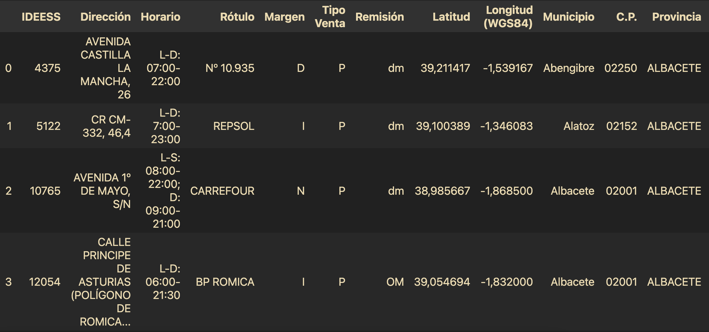
**Figura 3: Datos procesados de las Estaciones de Servicio.**

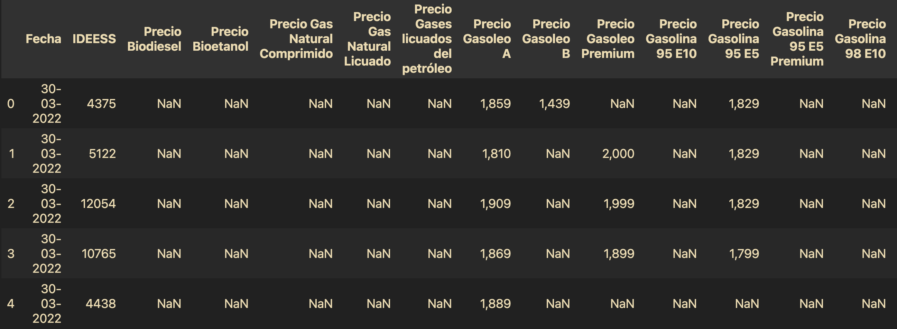
**Figura 4: Datos procesados de los precios del combustible en las distintas Estaciones de Servicio.**

# Conjuntos de datos 

Como se ha mencionado anteriormente, se ha dividido la información en dos conjuntos de datos distintos: *data/EESS.csv*, con la información de la Estación de Servicio; y *data/historico/precioEESS-{mes}-{año}.csv*, con los precios del combustible en cada Estación de Servicio para cada uno de los días de un determinado mes.

La forma de combinar los datos de ambos conjuntos es mediante el atributo **IDEESS**.

## Dataset Estaciones de Servicio 

El conjunto de datos *EESS.csv* se encuentra formado por los siguientes atributos:

| **Atributo**     | **Descripcion**                                                                                   | **Tipo** |
|------------------|---------------------------------------------------------------------------------------------------|----------|
| IDEESS           | Identificador único de la Estación de Servicio                                                    | Str      |
| Direccion        | Dirección de la Estación de Servicio                                                              | Str      |
| Horario          | Horario de la Estación de Servicio                                                               | Str      |
| Rotulo           | Rotulo o Marca de la Estación de Servicio                                                         | Str      |
| Margen           | Margen de la carretera en el que se encuentra: I = Izquierdo; D = Derecho; N = No aplica          | Str      |
| Tipo Venta       | Indica el tipo de venta de la Estación de Servicio: P = Publico General; R = Restringida a socios | Str      |
| Remision         | Procedencia del combustible: OM = Operador Mayorista; dm = Distribuidor minorista                 | Str      |
| Latitud          | Latitud de las coordenadas en la que se encuentra la Estación de Servicio                         | Float    |
| Longitud (WGS84) | Longitud de las coordenadas en la que se encuentra la Estación de Servicio                        | Float    |
| Municipio        | Municipio al que pertenece la Estación de Servicio                                                | Str      |
| C.P.             | Código Postal del municipio al que pertenece la Estación de Servicio                              | Str      |
| Provincia        | Provincia a la que pertenece la Estación de Servicio                                              | Str      |
| CCAA           | Nombre de la Comunidad Autónoma a la que pertenece la Estación de Servicio                 | Str      |

## Dataset precio combustible mensual 

El conjunto de datos *precioEESS-{mes}-{año}.csv* se encuentra formado por los siguientes atributos:

| **Atributo**                       | **Descripcion**                                                      | **Tipo** |
|------------------------------------|----------------------------------------------------------------------|----------|
| Fecha                              | Fecha a la que pertenecen los precios                                | Str      |
| IDEESS                             | Identificador de la Estación de Servicio                             | Str      |
| Precio Biodiesel                   | Precio del Biodiesel en la Estación de Servicio                      | Float    |
| Precio Bioetanol                   | Precio del Bioetanol en la Estación de Servicio                      | Float    |
| Precio Gas Natural Comprimido      | Precio del Gas Natural Comprimido en la Estación de Servicio         | Float    |
| Precio Gas Natural Licuado         | Precio del Gas Natural Licuado en la Estación de Servicio            | Float    |
| Precio gases licuados del petroleo | Precio de los gases licuados del petroleo en la Estación de Servicio | Float    |
| Precio Gasoleo A                   | Precio del Gasóleo A en la Estación de Servicio                      | Float    |
| Precio Gasoleo B                   | Precio del Gasóleo B en la Estación de Servicio                      | Float    |
| Precio Gasoleo Premium             | Precio del Gasóleo Premium en la Estación de Servicio                | Float    |
| Precio Gasolina 95 E10             | Precio de la Gasolina 95 E10 en la Estación de Servicio              | Float    |
| Precio Gasolina 95 E5              | Precio de la Gasolina 95 E5 en la Estación de Servicio               | Float    |
| Precio Gasolina 95 E5 Premium      | Precio de la Gasolina 95 E5 Premium en la Estación de Servicio       | Float    |
| Precio Gasolina 98 E10             | Precio de la Gasolina 98 E10 en la Estación de Servicio              | Float    |
| Precio Gasolina 98 E5              | Precio de la Gasolina 98 E5 en la Estación de Servicio               | Float    |
| % BioEtanol                        | Porcentaje de BioEtanol                                              | Float    |
| % Éster metílico                   | Porcentaje de éster metílico                                         | Float    |

# Pruebas de Ejecución 

Para ejecutar el script hay que ejecutar el comando `python obtenerPrecioCombustible.py` desde la raíz del proyecto.

**Video 1: Ejecución correcta del script.**

**Video 2: Ejecución del script cuando ya se disponen de los datos del día.**

# Gráficas Histórico de precios 

## CCAA

* Gasóleo A
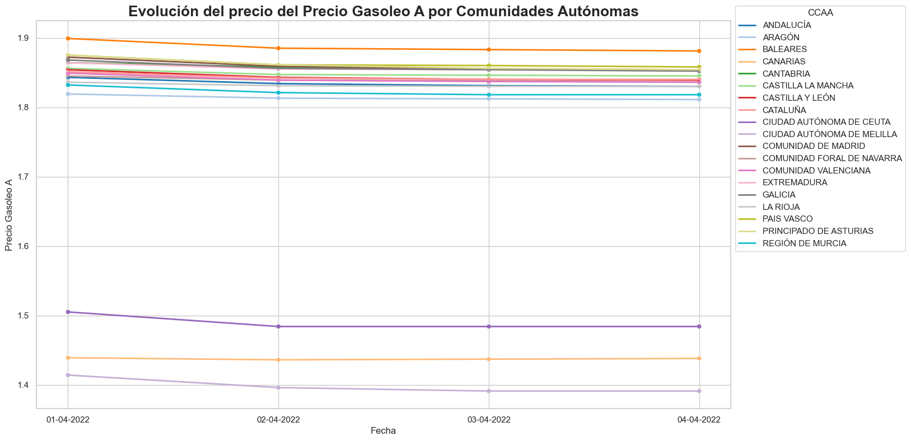
**Figura 5: Histórico Precio Gasóleo A por Comunidad Autónoma**

* Gasóleo Premium
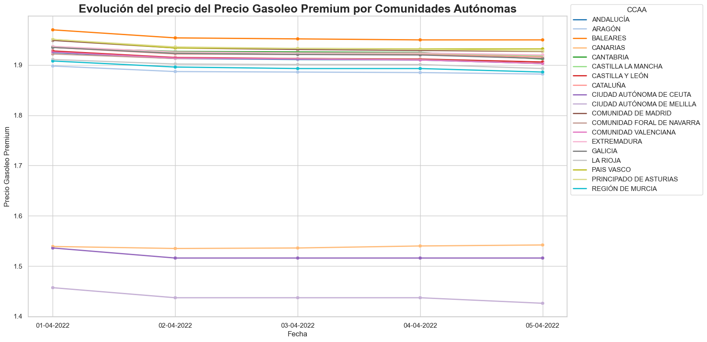
**Figura 5: Histórico Precio Gasóleo Premium por Comunidad Autónoma**

* Precio Gasolina 95 E5
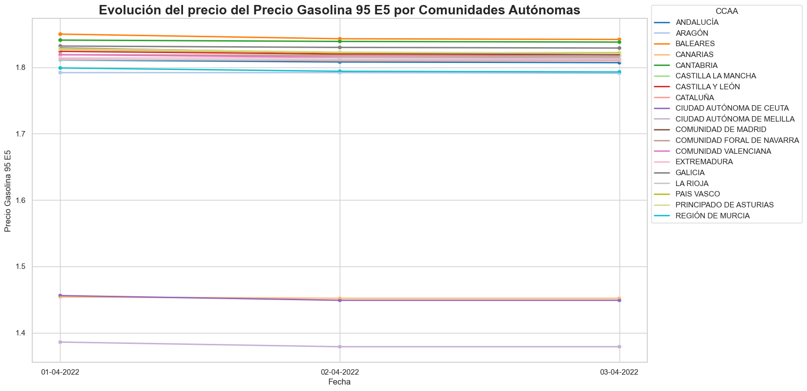
**Figura 6: Histórico Precio Gasolina 95 E5 por Comunidad Autónoma**

* Precio Gasolina 95 E10
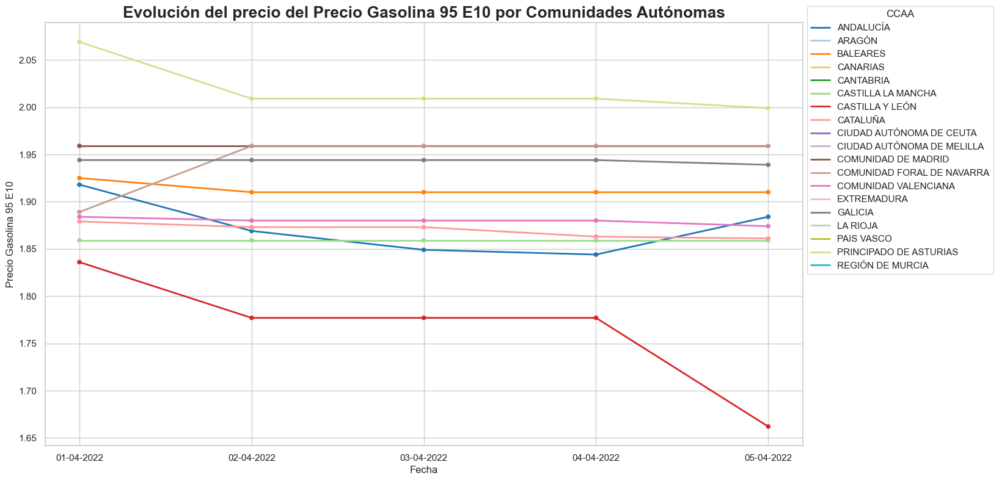
**Figura 7: Histórico Precio Gasolina 95 E10 por Comunidad Autónoma**

* Precio Gasolina 98 E5
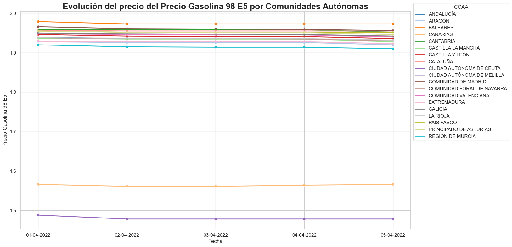
**Figura 8: Histórico Precio Gasolina 98 E5 por Comunidad Autónoma**

* Precio Gasolina 98 E10
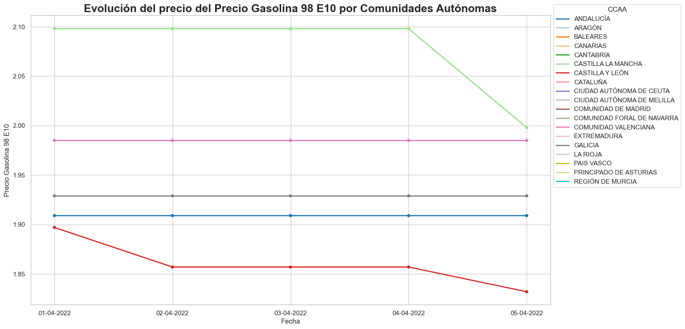
**Figura 9: Histórico Precio Gasolina 98 E10 por Comunidad Autónoma**

## Provincias
* Gasóleo A
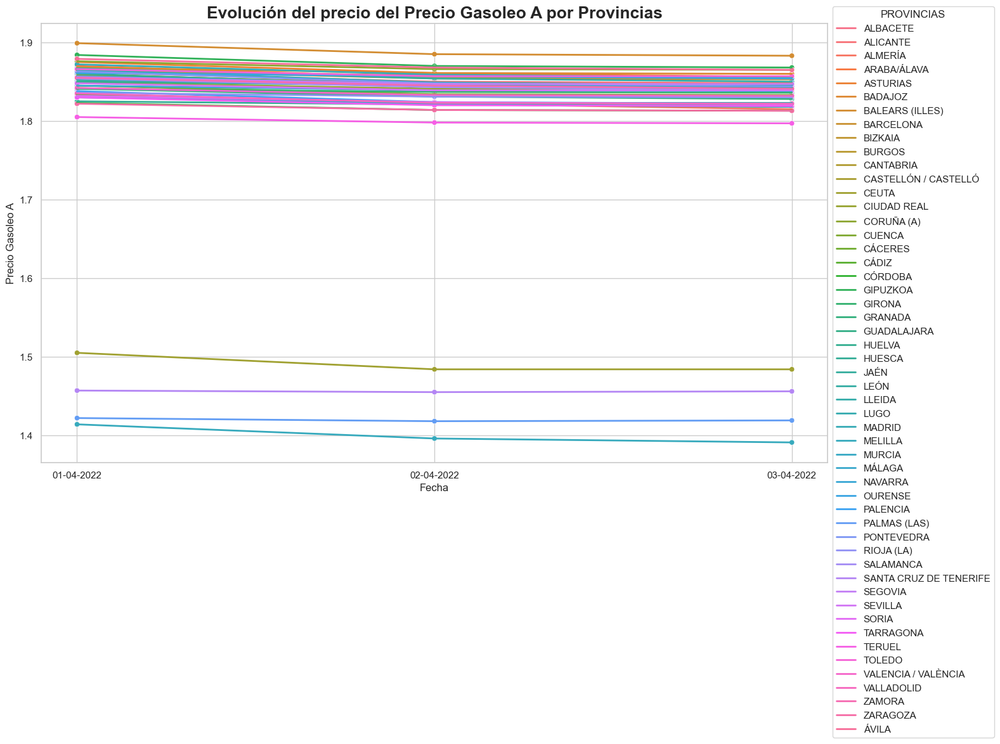
**Figura 10: Histórico Precio Gasóleo A por Provincias**

* Gasóleo Premium
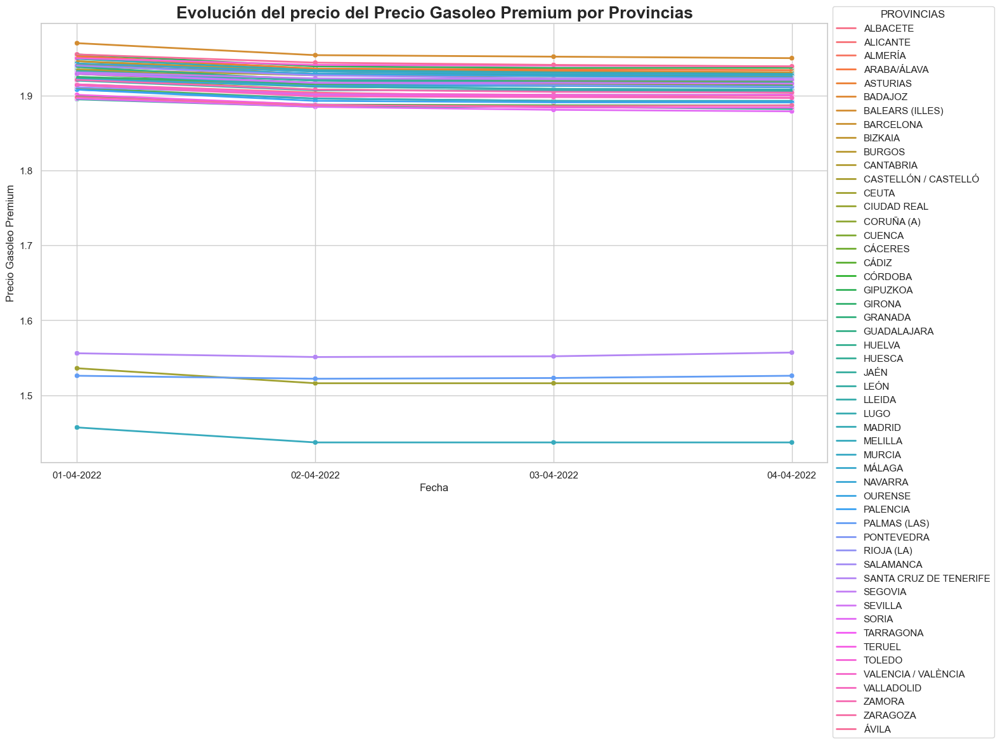
**Figura 11: Histórico Precio Gasóleo Premium por Provincias**

* Precio Gasolina 95 E5
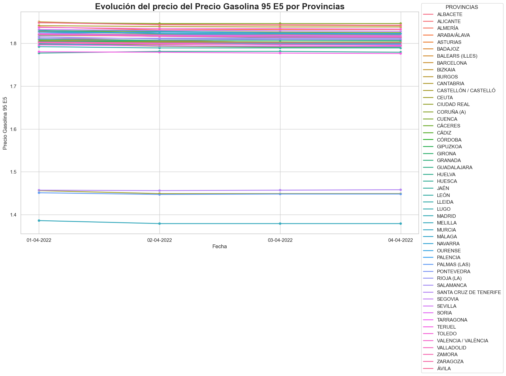
**Figura 12: Histórico Precio Gasolina 95 E5 por Provincias**

* Precio Gasolina 95 E10
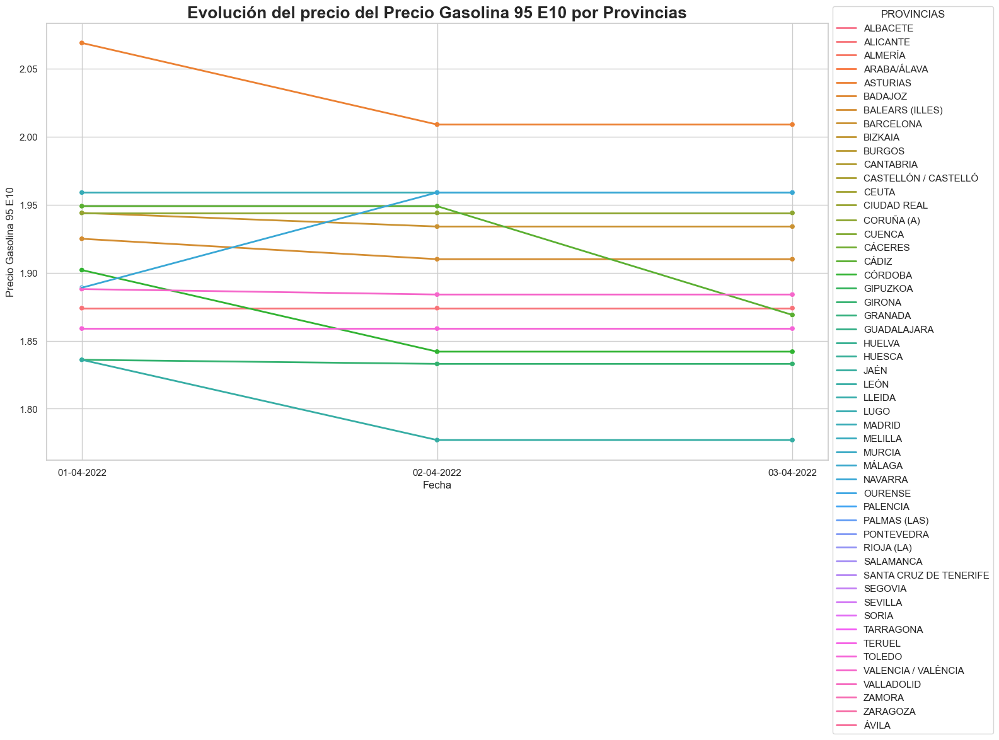
**Figura 13: Histórico Precio Gasolina 95 E10 por Provincias**

* Precio Gasolina 98 E5
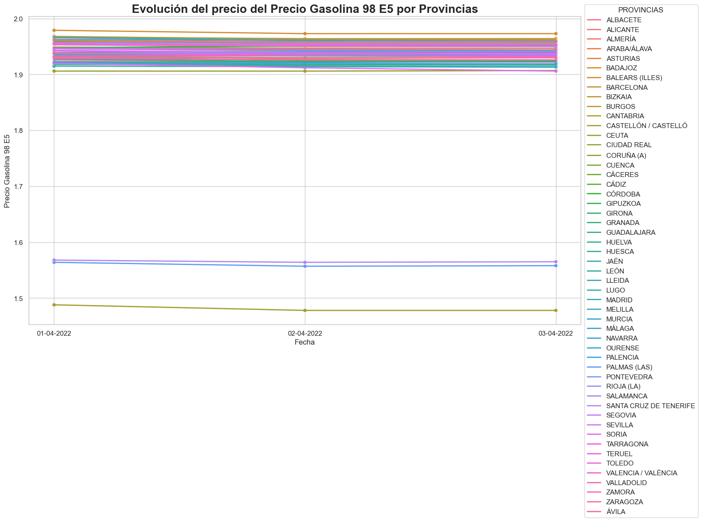
**Figura 14: Histórico Precio Gasolina 98 E5 por Provincias**

* Precio Gasolina 98 E10
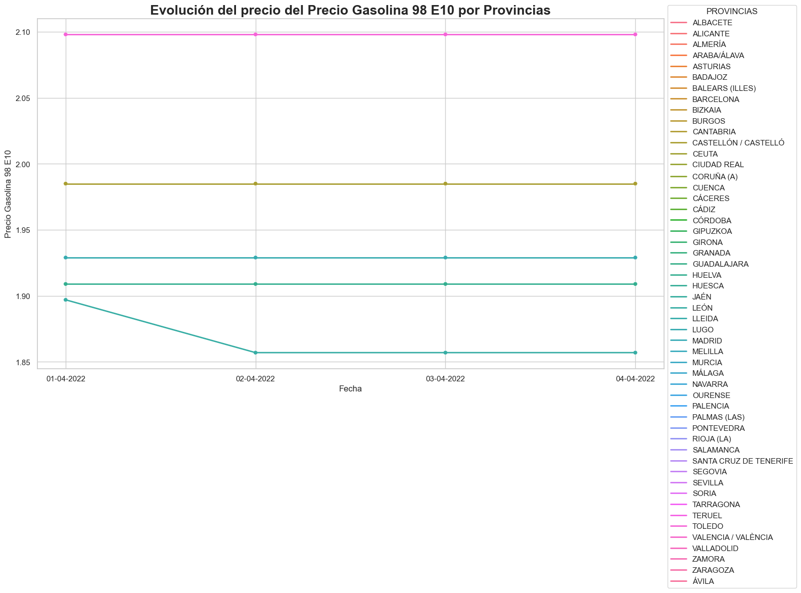
**Figura 15: Histórico Precio Gasolina 98 E10 por Provincias**
